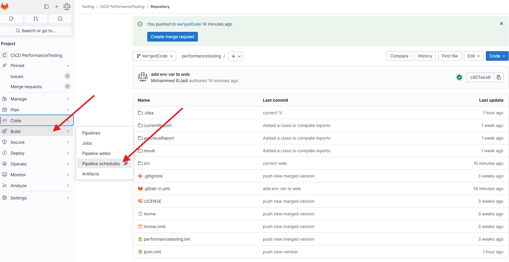
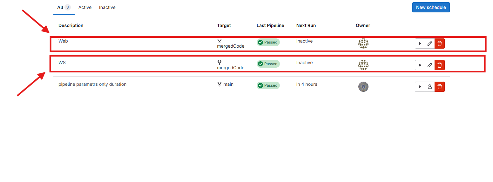
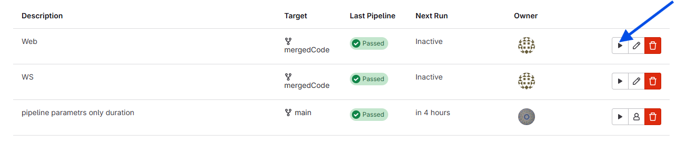
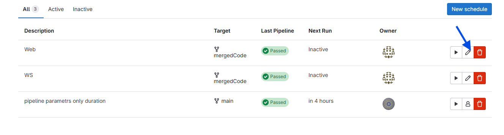
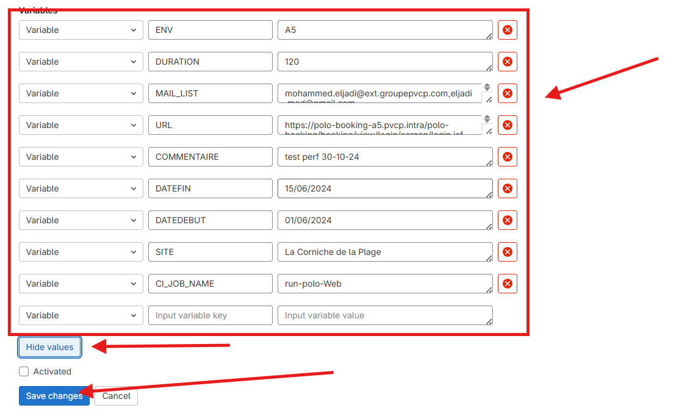

# Guide d'exécution des Pipelines GitLab pour les Tests de Performance

Ce document explique comment exécuter les pipelines **Test de Performance Web** et **Test de Performance WS**, configurer les variables et recevoir les résultats des tests par email.

---

## Aperçu des Pipelines

### 1. **Test de Performance Web**
Ce pipeline teste les performances des applications web.

### 2. **Test de Performance WS**
Ce pipeline teste les performances des services web (API).

---

## Comment Exécuter les Pipelines

### 1. **Accéder aux Pipelines**
1. Ouvrez le projet GitLab.
2. Allez dans **CI/CD > Planification des Pipelines**.




### 2. **Exécuter le Pipeline Désiré**
1. Trouvez le pipeline que vous souhaitez exécuter :
    - **Test de Performance Web**
    - **Test de Performance WS**



2. Cliquez sur le bouton **Play** à droite du pipeline pour l'exécuter manuellement.


---

## Configuration des Variables

### Visualisation et Modification des Variables
1. Allez dans **Build > Pipeline schedules**.
2. Cliquez sur le bouton **Modifier (petit stylo à droite du pipeline)** pour le pipeline désiré.



3. Modifiez les valeurs selon vos besoins.



### Variables pour Chaque Pipeline

#### **Test de Performance Web**

| Nom de la Variable  | Description                         | Valeur Exemple                                                                        |
|---------------------|-------------------------------------|---------------------------------------------------------------------------------------|
| `SITE`              | Nom du site testé                   | `La Corniche de la Plage`                                                             |
| `URL`               | URL de la page web                  | `https://polo-booking-a5.pvcp.intra/polo-booking/booking/view/login/screen/login.jsf` |
| `MAIL_LIST`         | Liste d'emails séparée par des virgules | `mohammed.eljadi@ext.groupepvcp.com,mohammed.babaoui@ext.groupepvcp.com`              |
| `DURATION`          | Durée du test en secondes           | `3600`                                                                                |
| `DATEDEBUT`         | Date de début du test               | `01/06/2024`                                                                          |
| `DATEFIN`           | Date de fin du test                 | `15/06/2024`                                                                          |
| `COMMENTAIRE`       | Commentaires pour le test           | `test perf 30-10-24`                                                                  |
| `ENV`               | Tag d'environnement                 | `A5`                                                                                  |

#### **Test de Performance WS**

| Nom de la Variable  | Description                         | Valeur Exemple                                                           |
|---------------------|-------------------------------------|--------------------------------------------------------------------------|
| `SITE`              | Nom du site testé                   | `BTP`                                                                    |
| `HEBERGEMENT`       | Nom de l'environnement d'hébergement | `BTP24X`                                                                 |
| `DATE`              | Date pour le test                    | `2025-02-25`                                                             |
| `ASSURANCE`         | Type d'assurance                    | `XXXACPACKDY`                                                            |
| `PRESTATION`        | Type de prestation                   | `BTPANIMAL`                                                              |
| `URL`               | Point de terminaison de l'API       | `http://azweupljbd03.pvcp.intra:8080/polo-ws/services/WsService?wsdl`    |
| `MAIL_LIST`         | Liste d'emails séparée par des virgules | `mohammed.eljadi@ext.groupepvcp.com,mohammed.babaoui@ext.groupepvcp.com` |
| `DURATION`          | Durée du test en secondes           | `3600`                                                                   |
| `ENV`               | Tag d'environnement                 | `A5`                                                                     |

---

## Comment Personnaliser les Variables
1. **Exemple de Pipeline Web :**
    - Si vous souhaitez tester un autre environnement web :
        - Modifiez `URL` avec l'URL de l'environnement cible.
        - Modifiez `ENV` avec la bonne valeur.
        - Ajustez `DURATION` pour la durée du test.
        - Ajoutez des destinataires à `MAIL_LIST`.

   Exemple :
   ```yaml
   URL=https://test.example.com
   ENV=T4
   DURATION=3600
   MAIL_LIST=tester@example.com
